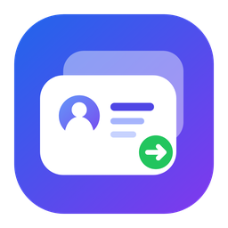

<div align="center">
  
  <h1>Codex Desktop Account Manager</h1>
  <p><strong>在一个轻量 Windows 窗口里，安全、快速地切换 Codex Desktop 账户。</strong></p>
  <p><strong>Switch Codex Desktop accounts safely and quickly from one lightweight Windows app.</strong></p>
  <p>
    
    
    
    
  </p>
  <p><a href="#中文">中文</a> · <a href="#english">English</a></p>
</div>

---

## 中文

### 它能做什么

Codex Desktop Account Manager 是一个面向 Windows 版 Codex Desktop 的本地账户管理工具。它把每个账户的 `auth.json` 保存为独立快照，让你不必反复退出、登录和复制文件，就能在 ChatGPT OAuth 账户与 API Key 模式之间切换。

| 功能 | 说明 |
|---|---|
| 一键切换账户 | 先安全结束旧 Codex，再写入目标凭据并校验，最后自动重新打开 Codex |
| 本地 PKCE OAuth | 使用 Chrome 无痕窗口添加账户，不运行 `codex login`，添加时不覆盖当前 Codex 登录 |
| 当前账户识别 | 自动识别正在使用的账户，并在唯一状态位显示“当前” |
| 智能自动刷新 | 回到前台时先增量同步本地用量（不联网），并且仅在当前账户限额缓存超过 5 分钟后查询该账户；自动过程中其他账户、内部点击、最小化和后台状态不请求，手动按钮仍可强制刷新全部 |
| 清晰的限额提醒 | 剩余 `<= 40%` 显示黄色，`<= 10%` 显示红色 |
| 两种用量口径 | 列表显示当前限额周期内的本地已归属用量；“用量”详情显示该账户全部已归属历史 |
| 本地账户库 | 导入、导出、复制、重命名、扫描备份和删除账户快照 |
| API Key 模式 | 可保存和切换 API Key；它按 API 用量计费，不占用 ChatGPT Plus/Pro 周限额 |

### 下载与运行

最简单的方式是从 [Releases](https://github.com/AvaterXXX/codex-desktop-account-manager/releases/latest) 下载 `CodexDesktopAccountManager.exe`，双击运行，无需安装 Python。

首次使用：

1. 保持 Codex Desktop 已经登录，点击“保存当前”。
2. 使用“OAuth 登录”添加其他 ChatGPT 账户，或从“导入账户”导入已有 `auth.json`。
3. 在账户行点击“切换”。默认会结束旧 Codex、切换凭据并重新启动。

### 用量与限额口径

- “周限额”来自 Codex 官方用量接口；百分比代表官方限额剩余情况。
- “本期用量”按 `周期起点 = 重置时间 - 窗口时长` 过滤本机 Codex 会话中的 token 事件。
- “用量”按钮展示此账户全部已明确归属的本地历史，不受当前限额周期过滤。
- Codex 会话文件本身不总是带账户 ID，因此工具只统计能够通过切换时间线明确归属的记录。官方百分比与本地 token 数不是同一种计量单位。
- 切换账户时会在启动新 Codex 前可靠写入时间边界；会话扫描与切换串行执行，并在回到前台时自动修复能够依据时间线确定的旧归属。

### 安全与隐私

`auth.json`、OAuth token 和 API Key 都等同于密码。这个项目采用本地优先设计：

- 凭据只保存在 `%USERPROFILE%\.codex` 和 `%USERPROFILE%\.codex-account-manager`。
- 仓库和构建脚本不会读取或打包上述目录。
- `.gitignore` 明确排除 `auth.json`、账户库、SQLite、日志、备份、构建目录和可执行文件。
- 删除当前 API Key 账户会清理本机匹配凭据，但不会替你撤销 OpenAI 或中转平台后台的远端 Key。
- 上传、分享或提交代码前，仍请自行确认没有手动复制凭据到源码目录。

> 本项目与 OpenAI 无隶属或官方合作关系。Codex、ChatGPT 和 OpenAI 是其各自权利人的商标。

### 从源码运行

```powershell
git clone https://github.com/AvaterXXX/codex-desktop-account-manager.git
cd codex-desktop-account-manager
python -m venv .venv
.\.venv\Scripts\Activate.ps1
python -m pip install -r requirements.txt
python main.py
```

### 构建 Windows EXE

```powershell
python -m pip install -r requirements-dev.txt
.\build.ps1
```

产物位于 `dist\CodexDesktopAccountManager.exe`。构建只包含 Python 模块与 `assets`，不会包含本机账户数据。

### 测试

```powershell
python -m pytest -q
python -m ruff check . --select E9,F
```

所有测试都使用临时目录和虚拟凭据，不会操作真实的 `~/.codex`。

---

## English

### What it does

Codex Desktop Account Manager is a local Windows utility for managing multiple Codex Desktop identities. It stores each account's `auth.json` as an isolated snapshot, so you can switch between ChatGPT OAuth accounts and API-key mode without repeatedly signing out or copying files by hand.

| Feature | Description |
|---|---|
| One-click switching | Stops the old Codex process, writes and verifies the target credentials, then relaunches Codex |
| Local PKCE OAuth | Adds an account in a Chrome Incognito window without running `codex login` or replacing the active login |
| Active-account detection | Detects the live identity and shows a single “Current” status badge |
| Smart auto-refresh | Returning to the foreground first syncs local usage without networking, then queries only the active account when its quota cache is at least 5 minutes old; automatic refresh ignores other accounts, internal clicks, minimized, and background states, while the manual button can still force a full refresh |
| Quota warnings | Remaining quota `<= 40%` is yellow and `<= 10%` is red |
| Two usage scopes | The account row shows locally attributed usage for the current quota window; the Usage dialog shows all attributed history |
| Local profile library | Import, export, copy, rename, scan backups, and delete account snapshots |
| API-key mode | Stores and switches API keys, which are billed as API usage and do not consume a ChatGPT Plus/Pro weekly quota |

### Download and use

Download `CodexDesktopAccountManager.exe` from [Releases](https://github.com/AvaterXXX/codex-desktop-account-manager/releases/latest) and run it directly. Python is not required.

Getting started:

1. Keep Codex Desktop signed in and click **Save Current**.
2. Add another ChatGPT account with **OAuth Login**, or import an existing `auth.json`.
3. Click **Switch** on an account row. By default, the app safely stops Codex, switches credentials, and relaunches it.

### Usage and quota semantics

- Weekly quota percentages come from the official Codex usage endpoint.
- Current-window usage filters local Codex token events using `window start = reset time - window duration`.
- The **Usage** dialog is intentionally unfiltered and shows all locally recorded events that can be attributed to the selected account.
- Account switches persist a reliable time boundary before the new Codex process starts. Session scans are serialized with switching, and foreground sync repairs older assignments that the timeline can determine.
- Codex session files do not always contain an account ID, so only events that can be attributed through the switch timeline are counted. Official quota percentages and local token totals are different measurements.

### Security and privacy

Treat `auth.json`, OAuth tokens, and API keys like passwords. This project is local-first:

- Credentials stay under `%USERPROFILE%\.codex` and `%USERPROFILE%\.codex-account-manager`.
- The repository and build script do not read or bundle those directories.
- `.gitignore` excludes auth files, profile stores, SQLite databases, logs, backups, build output, and executables.
- Deleting the active API-key profile removes matching local credentials; it does not revoke the remote key at OpenAI or another provider.
- Before publishing a fork, always verify that credentials were never manually copied into the source tree.

> This is an independent project and is not affiliated with or endorsed by OpenAI.

### Run from source

```powershell
git clone https://github.com/AvaterXXX/codex-desktop-account-manager.git
cd codex-desktop-account-manager
python -m venv .venv
.\.venv\Scripts\Activate.ps1
python -m pip install -r requirements.txt
python main.py
```

### Build the Windows executable

```powershell
python -m pip install -r requirements-dev.txt
.\build.ps1
```

The output is `dist\CodexDesktopAccountManager.exe`. The bundle contains only the application modules and `assets`; it does not include local account data.

### Tests

```powershell
python -m pytest -q
python -m ruff check . --select E9,F
```

Tests use temporary directories and fake credentials only. They never touch a real `~/.codex` directory.

---

<div align="center">
  <sub>Built for people who use more than one Codex Desktop account.</sub>
</div>
